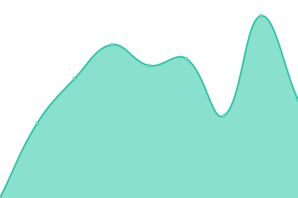

# [📈 Live Status](https://status.pxlbuzzard.com): <!--live status--> **🟧 Partial outage**

This repository contains the open-source uptime monitor and status page for [Daniel Jost](http://danieljost.com), powered by [Upptime](https://github.com/upptime/upptime).

With [Upptime](https://upptime.js.org), you can get your own unlimited and free uptime monitor and status page, powered entirely by a GitHub repository. We use [Issues](https://github.com/pxlbuzzard/upptime/issues) as incident reports, [Actions](https://github.com/pxlbuzzard/upptime/actions) as uptime monitors, and [Pages](https://status.pxlbuzzard.com) for the status page.

<!--start: status pages-->
<!-- This summary is generated by Upptime (https://github.com/upptime/upptime) -->
<!-- Do not edit this manually, your changes will be overwritten -->
<!-- prettier-ignore -->
| URL | Status | History | Response Time | Uptime |
| --- | ------ | ------- | ------------- | ------ |
|  [Daniel Jost](https://danieljost.com) | 🟩 Up | [daniel-jost.yml](https://github.com/PxlBuzzard/upptime/commits/HEAD/history/daniel-jost.yml) | 

 347ms
     
 | 

<a href="https://status.pxlbuzzard.com/history/daniel-jost">100.00%</a>
    

|  [ArchiveBox](https://archivebox.pxlbuzzard.com) | 🟥 Down | [archive-box.yml](https://github.com/PxlBuzzard/upptime/commits/HEAD/history/archive-box.yml) | 

 776ms
     
 | 

<a href="https://status.pxlbuzzard.com/history/archive-box">99.79%</a>
    

|  [Gitea](https://git.pxlbuzzard.com) | 🟩 Up | [gitea.yml](https://github.com/PxlBuzzard/upptime/commits/HEAD/history/gitea.yml) | 

 340ms
     
 | 

<a href="https://status.pxlbuzzard.com/history/gitea">99.79%</a>
    

|  [Home Assistant](https://homeassistant.pxlbuzzard.com) | 🟩 Up | [home-assistant.yml](https://github.com/PxlBuzzard/upptime/commits/HEAD/history/home-assistant.yml) | 

 264ms
     
 | 

<a href="https://status.pxlbuzzard.com/history/home-assistant">99.79%</a>
    

|  [Overseerr](https://request.pxlbuzzard.com) | 🟩 Up | [overseerr.yml](https://github.com/PxlBuzzard/upptime/commits/HEAD/history/overseerr.yml) | 

 1143ms
     
 | 

<a href="https://status.pxlbuzzard.com/history/overseerr">99.79%</a>
    

|  [Plex](https://plex.pxlbuzzard.com) | 🟥 Down | [plex.yml](https://github.com/PxlBuzzard/upptime/commits/HEAD/history/plex.yml) | 

 228ms
     
 | 

<a href="https://status.pxlbuzzard.com/history/plex">100.00%</a>
    

|  [XBackBone](https://share.pxlbuzzard.com) | 🟩 Up | [x-back-bone.yml](https://github.com/PxlBuzzard/upptime/commits/HEAD/history/x-back-bone.yml) | 

 1379ms
     
 | 

<a href="https://status.pxlbuzzard.com/history/x-back-bone">99.79%</a>
    

|  [Terris Top Treatments](https://terristoptreatments.com) | 🟩 Up | [terris-top-treatments.yml](https://github.com/PxlBuzzard/upptime/commits/HEAD/history/terris-top-treatments.yml) | 

 175ms
     
 | 

<a href="https://status.pxlbuzzard.com/history/terris-top-treatments">100.00%</a>
    

|  [Luann Spencer Steele](https://luannspencersteele.com) | 🟩 Up | [luann-spencer-steele.yml](https://github.com/PxlBuzzard/upptime/commits/HEAD/history/luann-spencer-steele.yml) | 

 278ms
     
 | 

<a href="https://status.pxlbuzzard.com/history/luann-spencer-steele">99.52%</a>
    

<!--end: status pages-->

[**Visit our status website →**](https://status.pxlbuzzard.com)

## 📄 License

- Powered by: [Upptime](https://github.com/upptime/upptime)
- Code: [MIT](./LICENSE) © [Daniel Jost](http://danieljost.com)
- Data in the `./history` directory: [Open Database License](https://opendatacommons.org/licenses/odbl/1-0/)
